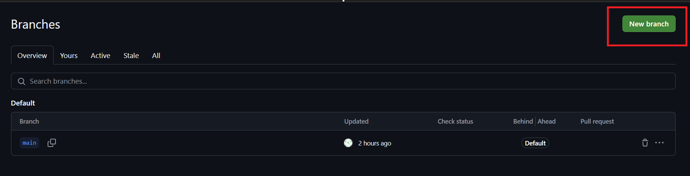

# BaseDeDatos2024

## Estructura del Repositorio

BaseDeDatos2024  
├── Clases  
│   ├── 00_Introducción  
│   ├── 01_Bases_De_Datos  
│   ├── 02_Orquestacion  
│   ├── 03_SQL  
│   ├── 04_DataWarehouses  
│   ├── 04_NocoDB  
├── docker-entrypoint-initdb  
├── gtfs  
│   ├── .ssh_tunnel  
│   ├── charts  
│   ├── custom  
│   ├── custom_templates  
│   │   ├── blocks  
│   │   │   ├── dlt_ingestion  
│   ├── data_exporters  
│   ├── data_loaders  
│   ├── dbt  
│   ├── extensions  
│   ├── interactions  
│   ├── pipelines  
│   │   ├── bitter_arcanist  
│   │   ├── endearing_pine  
│   │   ├── example_pipeline  
│   │   ├── gtfs_realtime_pipeline  
│   │   ├── gtfs_static_pipeline  
│   │   ├── gtfs_static_pipeline_dlt  
│   │   ├── test  
│   │   ├── yrdy  
│   ├── scratchpads  
│   ├── transformers  
│   ├── utils  
├── mage_data  
│   ├── gtfs  
│   │   ├── .operation_history  
│   │   ├── pipelines  
│   │   │   ├── gtfs_realtime_pipeline  
│   │   │   ├── gtfs_static_pipeline  
│   │   ├── test  
├── .env.example  
├── Dockerfile  
├── README.md  
├── docker-compose.yml  
├── poetry.lock  
├── pyproject.toml  
├── requirements.txt  

## 1° Paso: Clonar el repositorio
 Ir al Repositorio de GitHub:
 
 

Ir a "Branch"


Crear una nueva Branch con su nombre




Clonar el repositorio con

```bash
git clone https://github.com/GraffignaBracco/BaseDeDatos2024.git
```

Cambiar a la branch que crearon:


## 2° Paso: Crear un Ambiente de python para poder usar las librerías necesarias.


Lo primero que hay que hacer es "ir" con la terminal hasta la carpeta del Repositorio. Esto se hace con este comando desde la misma terminal de VSCode:

```bash
cd BaseDeDatos2024
```

### Opción 1: Con Anaconda

Una vez que estamos en la carpeta del repositorio  utiliza el siguiente comando para crear un entorno llamado `base_de_datos` con Python 3.11:
```bash
conda create --name base_de_datos python=3.11
```
Una vez creado, activa el entorno con el siguiente comando:

```bash
conda activate base_de_datos
```

Luego, instalá las dependencias con este comando:

```bash
pip install -r requirements.txt
```

### Opción 2: Con Poetry
Si no quieren usar anaconda, pueden usar poetry que es otra librería para manejar dependencias

el primer paso es instalar la librería

```bash
pip install poetry
```

Luego, instalan todas las dependencias con el comando:

```bash
poetry install
```

Una vez que las dependencias estén instaladas, puedes acceder al entorno virtual de Poetry con:

```bash
poetry shell
```

Para crear un kernel en Jupyter vinculado a este entorno de Poetry, ejecuta el siguiente comando:

```bash
python -m ipykernel install --user --name=base_de_datos --display-name "Python (base_de_datos)"
```


## 3° Paso: Copiar el archivo .env.example y cambiarle el nombre a ".env"

```yaml
PROJECT_NAME=gtfs
POSTGRES_DBNAME=gtfs
POSTGRES_SCHEMA=public
POSTGRES_USER=postgres
POSTGRES_PASSWORD=1234
POSTGRES_PORT=5432
POSTGRES_HOST=postgres
```

Modificar cualquier variable de entorno (Por ejemplo, cambiar el nombre del proyecto)

## 4° Paso: Levantar los servicios de Docker:

Abrir la aplicación "Docker Desktop" en sus computadoras y asegurarse que el "Docker Engine" esté corriendo.

Construir la imagen de Mage

```bash
docker compose build
```

Levantar los contenedores:

```bash
docker compose up
```